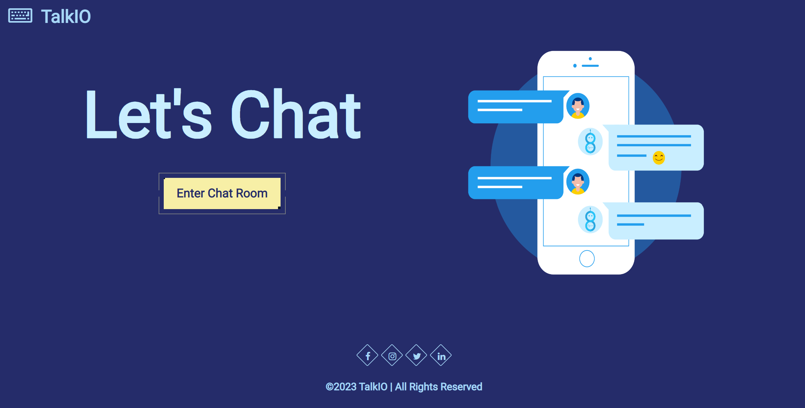

# Real time chat app!

# Description:

## Welcome everyone! The private messaging website that you can use to talk to people that you know, and to hide messages from people that you don't know!

# Tech Used:

## HTML, CSS, JavaScript, Node.js, Express.js, MySQL2, Sequelize, BCrypt, .env, API, HandleBars, Socket.iO 

# Screenshots:

## When you first enter the website, you are presented with two options. In case you don't have an account, you can create a new one. If you already have one, you can log right in!

# This is a screenshot of the website in action:

